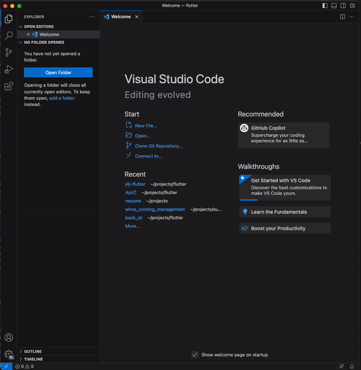
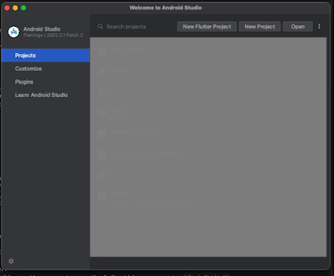

# Flutter Setup Guide

- [Prerequisites](#prerequisites)
- [Step 1: Install Flutter SDK](#step-1-install-flutter-sdk)
- [Step 2: Set Up Environment Variables](#step-2-set-up-environment-variables)
  - [Windows](#windows)
  - [macOS](#macos)
- [Step 3: Install Dart SDK](#step-3-install-dart-sdk)
- [Step 4: Install Visual Studio Code Extensions](#step-4-install-visual-studio-code-extensions)
- [Step 5: Additional Setup for Android Development](#step-5-additional-setup-for-android-development)
- [Step 6: Additional Setup for iOS Development (macOS only)](#step-6-additional-setup-for-ios-development-macos-only)
- [Verifying the Installation](#verifying-the-installation)

---

This guide will walk you through the steps to set up Flutter on your Windows or macOS system for iOS and Android development. Please follow the instructions carefully.

Note:

This tutorial is based on the official Flutter documentation: [https://flutter.dev/docs/get-started/install](https://flutter.dev/docs/get-started/install). You should check the documentation for more information.

This tutorial is for Windows and macOS only. If you are using Linux, please refer to the official documentation: [https://flutter.dev/docs/get-started/install/linux](https://flutter.dev/docs/get-started/install/linux).

## Prerequisites

Before you begin, ensure that you have the following software installed on your system:

- Flutter SDK (latest version)
- Dart SDK (included with Flutter)
- Visual Studio Code (VSCode) or any other preferred code editor
- Xcode (developing for iOS/macOS - 🛎️ available only on macOS 🛎️)
- Android Studio (developing for Android's latest version)

## Step 1: Install Flutter SDK

1. Visit the Flutter website: [https://flutter.dev](https://flutter.dev).
2. Click on the "Get Started" button.
3. Select your operating system (Windows, macOS).
4. Download the Flutter SDK for your respective operating system.
5. Extract the downloaded ZIP file to a desired location on your system.

⚠️ Do not install Flutter on a path that contains special characters or spaces.

Windows users:

⚠️ Do not install Flutter in a directory like `C:\Program Files\` that requires elevated privileges.

## Step 2: Set Up Environment Variables

### Windows

1. Open the Start menu and search for `environment variables.`
2. Click on "Edit the system `environment variables`."
3. In the System Properties window, click on the `Environment Variables` button.
4. Under User variables, check if there is an entry called Path:
   1. If the entry exists, append the full path to `flutter\bin` using `;` as a separator from existing values.
   2. If the entry doesn't exist, create a new user variable named path with the full path to `flutter\bin` as its value.
5. Click "OK" to save the changes.

### macOS

1. Open Terminal.
2. Run the following command to open the Bash profile file: `open ~/.bashrc.`
3. Add the following line to the file and save it:
   - `export PATH="$PATH:[PATH_TO_FLUTTER_SDK]/bin"`
4. Close and reopen the terminal for the changes to take effect.

## Step 3: Install Dart SDK

Since the Dart SDK is bundled with Flutter, you don't need to install it separately.

## Step 4: Install Visual Studio Code Extensions



1. Open Visual Studio Code (VSCode).
2. Open the Extensions view by clicking on the square icon on the left sidebar or pressing `Ctrl+Shift+X.`
3. Search for the `Flutter` extension.
4. Click on the "Install" button to install the extension.
5. This will also install the `Dart` extension.

## Step 5: Additional Setup for Android Development

1. Download and install Android Studio from the official website: [https://developer.android.com/studio](https://developer.android.com/studio).
2. Launch Android Studio and follow the installation wizard to set up the necessary components.
3. open Android Studio's SDK Manager once the installation is complete.
4. Ensure that the following components are installed:
   - Android SDK
   - Android SDK Platform
   - Android Virtual Device (AVD)
   - Intel x86 Emulator Accelerator (HAXM installer)
5. If you wish to develop Flutter applications using the Android Studio IDE, install the Flutter and Dart plugins.

   

6. On the main screen, click `plugins,` search for `flutter,` and install the Flutter extension. It will also install the `Dart` extension

## Step 6: Additional Setup for iOS Development (macOS only)

1. Install Xcode from the Mac App Store.
2. Launch Xcode and accept the license agreement.
3. Install additional components prompted by Xcode.
4. Run the following command in the terminal to install Xcode command line tools: `sudo xcode-select --switch /Applications/Xcode.app/Contents/Developer`.
5. Launch Xcode and go to "Preferences"> "Locations."
6. Ensure the "Command Line Tools" option is selected for your installed Xcode version.

## Verifying the Installation

To verify that Flutter is set up correctly, run the following command in the terminal:

```bash
flutter doctor
```

This command will check for any missing dependencies or some missing configurations and guide you on how to resolve them.

Congratulations! You have successfully set up Flutter for iOS and Android development on your Windows or macOS system.
